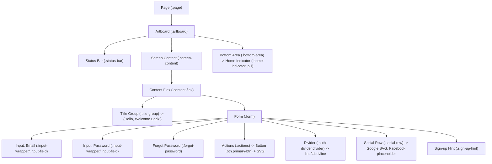

# Recipe Manager Frontend UI Overview

## Introduction

This document describes the implemented UI of the Recipe Manager frontend, with a focus on the Sign In screen. It covers the high-level UI architecture, a detailed breakdown of the screen’s sections, styling and responsiveness details, mapping of design assets to code, and notes on readiness for future pages. The content reflects the current codebase to ensure fidelity between documentation and implementation.

## High-Level UI Architecture

### Background

The frontend is a React single-page application using React Router for navigation. The landing route renders the Sign In screen, which is built to mirror a Figma-provided design using plain CSS and semantic HTML structure. No third-party UI frameworks are used; styles are authored in CSS files with reusable tokens.

### Scope

- Routing and entry (App): routes for "/", "/dashboard", and "/recipes/add".
- Sign In screen composition and behavior.
- Style system: a core token file (common.css) plus a screen-specific stylesheet (sign-in-11-235.css).
- Asset mapping, including the inlined Google "G" SVG.
- Extensibility recommendations for future screens.

## Implementation

### Design Choices

The codebase uses a lightweight approach for a clean, performant UI:
- Plain React with React Router ensures easy page composition.
- Pure CSS for styling provides full control and low dependency overhead.
- Design tokens in CSS custom properties centralize color, typography, and spacing scales.
- A pseudo “artboard” creates a mobile-frame preview for consistent visual layout during development.

### Architecture

Entry and routing:
- src/index.js bootstraps the React application.
- src/App.js defines the router and routes:
  - "/" → SignInScreen (src/screens/SignInScreen.jsx)
  - "/dashboard" → Dashboard placeholder (inline component in App.js)
  - "/recipes/add" → AddRecipe placeholder (inline component in App.js)

Styles:
- src/styles/common.css provides global tokens and shared component styles (buttons, inputs, layout helpers).
- src/styles/sign-in-11-235.css contains Sign In screen–specific spacing and layout tweaks.
- src/App.css keeps app-level minimal adjustments.

The Sign In screen structure follows an artboard-like container to mirror a 375 × 812 mobile design with a bottom home-indicator element for fidelity.

## Sign In Screen: Section-by-Section Breakdown

### Header

- Status bar placeholder:
  - Element: 

  - Purpose: reserves vertical space representing a mobile status area, not interactive and visually minimal.
- Title group:
  - Structure:
    - <h1 class="hello">Hello,</h1>
    - 
Welcome Back!

  - Typography and spacing are controlled by tokens (typo-60 and typo-61) and sign-in–specific padding.

### Form

- Form container:
  - <form className="form" noValidate onSubmit={onSubmit}>
  - Layout: flex column with configured gaps from sign-in-11-235.css (gap: 20px).
  - Behavior:
    - onSubmit prevents default, logs values for developer visibility, then navigates to /dashboard (placeholder for future authentication flow).

### Inputs

- Email input:
  - Wrapper: 

  - Label: <label className="input-label" htmlFor="email">Email</label>
  - Field: <input id="email" name="email" type="email" className="input-field" placeholder="Enter Email" required />
  - Styles: shared input-field rules define height, border, radius, padding, font; placeholder color via tokens.
- Password input:
  - Analogous structure with id="password", type="password", and placeholder "Enter Password".

### Actions (Primary Sign In Button and Forgot Password)

- Forgot Password:
  - Element: <button className="forgot-password" onClick={onForgot}>Forgot Password?</button>
  - Behavior: demo alert; styled as a text link with brand accent color (ff9c00).
- Sign In button:
  - Element: <button type="submit" className="btn primary-btn" aria-label="Sign In">
  - Content: Sign In and an inline SVG arrow icon sized to 20×20.
  - Styles: .primary-btn from common.css for full-width height, brand background, and radius.

### Divider: "Or Sign in With"

- Structure: 

  - Three-column grid with two .line elements on the sides and centered .label "Or Sign in With".
  - Provides visual separation between primary credentials sign in and social sign in options.

### Social Buttons and Google SVG

- Social row:
  - Element: 

  - Two square icon buttons using .btn.icon-square.
- Google button:
  - Uses inline SVG for the official "G" monogram (colored paths).
  - SVG viewBox 0 0 48 48; scaled within a 24px container via .icon-google and .google-g classes.
  - Behavior: onClick triggers demo alert via onSocial("Google").
- Facebook button:
  - Placeholder square with a blue background and an “f” pseudo-element, sized to 24px within a 44px button container.
  - Behavior: onClick triggers demo alert via onSocial("Facebook").

### Spacing

- Vertical rhythm:
  - Base padding and gaps reside in common.css (screen-content padding, content-flex gaps).
  - The sign-in-11-235.css file increases some spacings (e.g., screen-content padding-top: 52px, form gap: 20px) to closely match the Figma vertical scale.
- Input spacing:
  - input-wrapper uses an internal gap for label-to-field spacing.
- Actions spacing:
  - .actions margin-top and divider margins are tuned in sign-in-11-235.css.

### Bottom Bar (Home Indicator)

- Bottom area:
  - 
 anchoring the home indicator to the artboard bottom.
  - .bottom-area uses margin-top: auto to stick to bottom within the flex column artboard.
- Home indicator:
  - 

  - Dimensions and rounded radius emulate mobile home indicators.

## Styling and Responsiveness

### Flex/Grid Usage

- Flex:
  - Artboard displays as a flex column to allow the bottom area to push down via margin-top: auto.
  - Form and content containers use flex-direction: column with gaps for spacing.
- Grid:
  - Divider uses CSS Grid (1fr auto 1fr) to provide balanced lines on each side of the label.

### CSS Modules/Files

- Global style tokens and shared components:
  - src/styles/common.css
    - Defines CSS custom properties for colors, typography, spacing/radius, shadows.
    - Contains shared component classes: .btn, .primary-btn, .input-field, .divider, .icon-square, .artboard, .page, etc.
- Screen-specific overrides:
  - src/styles/sign-in-11-235.css
    - Imported in App.js after common.css.
    - Adjusts paddings, gaps, and sizes to match the Figma sign-in screen precisely.
- App-level stylesheet:
  - src/App.css
    - Minimal, currently sets .App min-height.

### Responsiveness

- Centered “artboard” approach:
  - The .page container uses grid centering to keep the artboard vertically and horizontally centered regardless of viewport dimensions.
  - The artboard uses a fixed width (375px) and min-height (812px) to mirror mobile reference dimensions and avoid layout shift.
- Desktop and larger screens:
  - The artboard remains centered with a subtle drop shadow and rounded corners, providing a consistent preview frame.
- Accessibility:
  - Semantic roles and labels are included, e.g., role="main", aria-labels on buttons and separators.
  - Status bar and bottom area are aria-hidden to not clutter screen readers.

## Asset and Design Source Mapping

### From Figma to Code

- Typography:
  - Poppins-based sizes and line-heights represented as CSS variables (e.g., --typo-60-size: 30px; --typo-60-line: 45px).
- Colors:
  - Design tokens mapped to --color-XXXXXX CSS variables for black, white, brand green (129575), neutral grays, and accents.
- Shadows and radii:
  - --shadow-3 and --radius-10 used to mirror card-like primary elements and input/button rounding.
- Spacing:
  - Base spacing in common.css; sign-in-11-235.css bumps are derived from the Figma block spacing to get visual parity.
- Home indicator:
  - The pill dimensions reflect the Figma home-indicator look while staying purely decorative.

### Assets

- Google "G" SVG:
  - Inlined directly within the Sign In screen component to ensure sizing and color fidelity.
  - ViewBox and path fills match official brand colors.
- Facebook placeholder:
  - Approximated using a blue square with an “f” pseudo-element for demonstration.

## Extension and Readiness for Future Pages

### Future Pages

- App.js already includes placeholders for:
  - Dashboard ("/dashboard")
  - Add Recipe ("/recipes/add")
- These placeholders utilize the same .page, .artboard, and .screen-content layout primitives established by the Sign In screen for consistent styling and structure.

### Design Choices

- Shared tokens make it straightforward to style new components consistently.
- The artboard pattern can be kept for mobile-first screens or adapted:
  - For desktop-oriented pages, the outer .page container remains useful while the inner layout can be expanded to fluid widths.
- Componentization opportunities:
  - Inputs and buttons can be extracted to shared React components for reuse.
  - Divider and social button patterns can be generalized for onboarding flows.
- Accessibility and i18n:
  - Continue using aria-labels/roles and avoid text baked into images.
  - Ensure labels and placeholders are easy to internationalize.

## Conclusion

### Summary

The Sign In screen provides a Figma-faithful implementation using lightweight React and CSS, with a clear separation between shared tokens and screen-specific adjustments. The layout leverages flex/grid for predictable spacing and alignment, and an artboard pattern ensures visual consistency across viewports. Assets like the Google monogram are inlined for precision. The router and shared primitives are ready for adding and refining new screens such as Dashboard and Add Recipe while maintaining a consistent design system.

## Appendix

### Mermaid: UI Structure (Sign In)

### References (Source Files)

- src/App.js
- src/screens/SignInScreen.jsx
- src/styles/common.css
- src/styles/sign-in-11-235.css
- src/App.css
